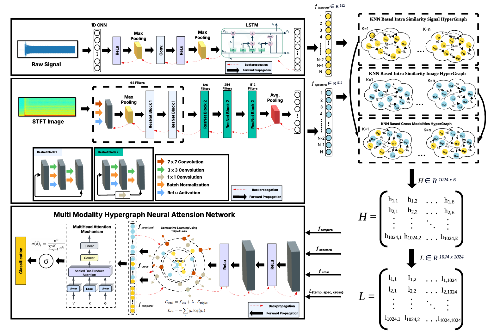

# Hypergraph Contrastive Sensor Fusion for Multimodal Fault Diagnosis in Induction Motors

> ### ✨ Authors
> 
> [**Usman Ali**](https://scholar.google.com/citations?user=2A32xVQAAAAJ&hl=en) • [**Ali Zia**](https://ali-zia.me/) • [**Waqas Ali**](https://scholar.google.com/citations?user=J8_Ko78AAAAJ&hl=en) • [**Umer Ramzan**](https://scholar.google.com/citations?user=D3AhoccAAAAJ&hl=en) • [**Abdul Rehman**](https://scholar.google.com.pk/citations?user=A_jBBxIAAAAJ&hl=en) • [**Muhammad Tayyab Chaudhry**](https://scholar.google.com/citations?user=-mECuFEAAAAJ&hl=en) • [**Wei Xiang**](https://scholar.google.com/citations?user=VxQUr90AAAAJ&hl=en)

## 🧠 Overview

Reliable induction motor (IM) fault diagnosis is vital for industrial safety and operational continuity, mitigating costly unplanned downtime. Conventional approaches often struggle to capture complex multimodal signal relationships, are constrained to unimodal data or single fault types, and exhibit performance degradation under noisy or cross-domain conditions. This paper proposes the Multimodal Hypergraph Contrastive Attention Network (MM-HCAN), a unified framework for robust fault diagnosis. To the best of our knowledge, MM-HCAN is the first to integrate contrastive learning within a hypergraph topology specifically designed for multimodal sensor fusion, enabling the joint modelling of intra- and inter-modal dependencies and enhancing generalisation beyond Euclidean embedding spaces. The model facilitates simultaneous diagnosis of bearing, stator, and rotor faults, addressing the engineering need for consolidated diagnostic capabilities. Evaluated on three real-world benchmarks, MM-HCAN achieves up to 99.82% accuracy with strong cross-domain generalisation and resilience to noise, demonstrating its suitability for real-world deployment. An ablation study validates the contribution of each component. MM-HCAN provides a scalable and robust solution for comprehensive multi-fault diagnosis, supporting predictive maintenance and extended asset longevity in industrial environments.

---

## 🏗️ Architecture Overview

Below is the overall architecture of **MM-HCAN**:



---

## ⚙️ System Specifications

- **OS:** Ubuntu 22.04  
- **GPU:** NVIDIA RTX 4080  
- **Python:** 3.10  
- **Torch:** 2.7.1  

---

## 🧩 Environment Setup

Create and activate the environment:
```bash
$ conda create --name MMHCAN --file requirements.txt
$ conda activate MMHCAN
```
